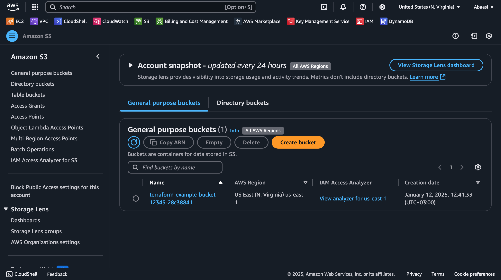
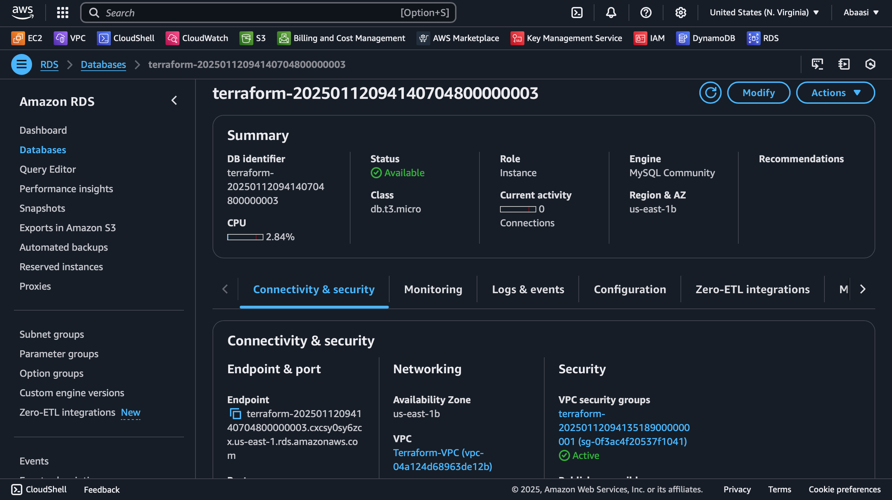
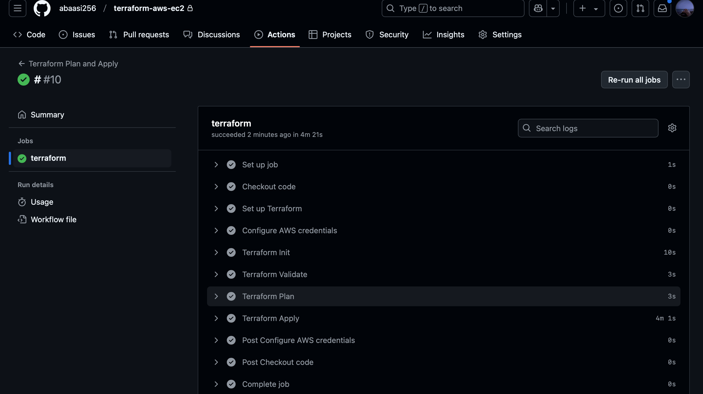

# Terraform AWS Infrastructure Deployment

This project demonstrates how to use **Terraform** to provision and manage **AWS resources**, including:
- **VPC**: Virtual Private Cloud with subnets, internet gateway, and route tables.
- **S3 Bucket**: Secure S3 bucket with a bucket policy to enforce HTTPS access.
- **RDS Instance**: MySQL database instance with a security group and subnet group across multiple AZs.
- **GitHub Actions**: Automated Terraform workflow for CI/CD.

## Screenshots

### AWS VPC
This screenshot shows the VPC created using Terraform, including subnets, route tables, and internet gateway.


### S3 Bucket
This screenshot shows the S3 bucket created using Terraform, with a bucket policy enforcing HTTPS access.



### RDS Instance
This screenshot shows the MySQL RDS instance deployed across multiple Availability Zones.



### GitHub Actions Workflow
This screenshot shows the successful execution of the GitHub Actions workflow for Terraform.



## Prerequisites
- **AWS Account**: Ensure you have an AWS account with the necessary permissions.
- **Terraform**: Install Terraform on your local machine.
- **GitHub Repository**: Fork or clone this repository.

## Setup
1. **Clone the Repository**:
   ```bash
   git clone https://github.com/abaasi256/terraform-aws-ec2.git
   cd terraform-aws-ec2

   ## Contributors
- **Abaasi**: Project author and maintainer.

## About the Author
Hi, I'm **Abaasi**, a cloud and DevOps enthusiast passionate about automating infrastructure using Terraform. This project is a reflection of my skills and expertise in AWS and Infrastructure as Code (IaC). Connect with me on [LinkedIn](https://www.linkedin.com/in/abaasi-k-b79420340) or check out my other projects on [GitHub](https://github.com/abaasi256).
