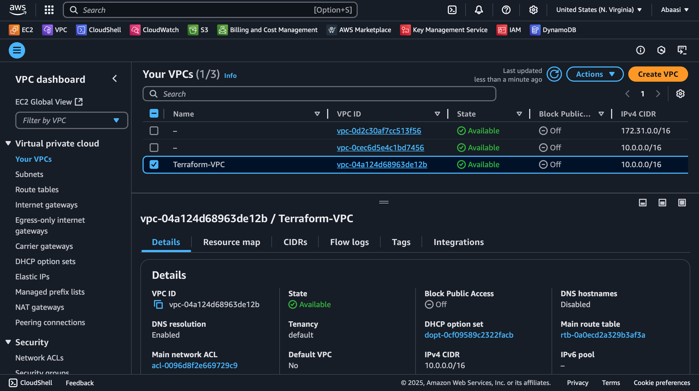

# Terraform AWS Infrastructure Deployment

This project demonstrates how to use **Terraform** to provision and manage **AWS resources**, including:
- **VPC**: Virtual Private Cloud with subnets, internet gateway, and route tables.
- **S3 Bucket**: Secure S3 bucket with a bucket policy to enforce HTTPS access.
- **RDS Instance**: MySQL database instance with a security group and subnet group across multiple AZs.
- **GitHub Actions**: Automated Terraform workflow for CI/CD.

---

## Screenshots

### AWS VPC
This screenshot shows the VPC created using Terraform, including subnets, route tables, and internet gateway.



### S3 Bucket
This screenshot shows the S3 bucket created using Terraform, with a bucket policy enforcing HTTPS access.


### RDS Instance
This screenshot shows the MySQL RDS instance deployed across multiple Availability Zones.


### GitHub Actions Workflow
This screenshot shows the successful execution of the GitHub Actions workflow for Terraform.


---

## Project Overview
This Terraform project automates the deployment of a secure and scalable AWS infrastructure, including:
- **VPC**: A Virtual Private Cloud with public subnets.
- **Subnets**: Two public subnets across different availability zones.
- **Internet Gateway**: Enables internet access for resources in the public subnets.
- **Route Table**: Configures routing for the public subnets.
- **S3 Bucket**: A private S3 bucket with a lifecycle policy to expire objects after 90 days.
- **RDS Instance**: A MySQL database instance with restricted access within the VPC.
- **Security Groups**: Ensures secure communication between resources.

The project is designed to follow best practices for security, scalability, and maintainability.

---

## Prerequisites
Before using this Terraform configuration, ensure you have the following:
1. **Terraform Installed**: Download and install Terraform from [here](https://www.terraform.io/downloads.html).
2. **AWS CLI Configured**: Set up your AWS credentials using the AWS CLI or environment variables.
3. **AWS Account**: Ensure you have an AWS account with sufficient permissions to create the resources.
4. **GitHub Repository**: Fork or clone this repository.

---

## Setup

### 1. Clone the Repository
```bash
git clone https://github.com/abaasi256/terraform-aws-ec2.git
cd terraform-aws-ec2
```

### 2. Initialize Terraform
Run the following command to initialize Terraform and download the required providers:
```bash
terraform init
```

### 3. Validate the Configuration
Validate the Terraform configuration for syntax errors:
```bash
terraform validate
```

### 4. Plan the Deployment
Preview the changes Terraform will make:
```bash
terraform plan
```

### 5. Apply the Configuration
Deploy the infrastructure:
```bash
terraform apply
```

### 6. Destroy the Infrastructure
When you no longer need the infrastructure, destroy it to avoid unnecessary costs:
```bash
terraform destroy
```

---

## Resources Created
This Terraform configuration creates the following AWS resources:
1. **VPC**: A Virtual Private Cloud with a CIDR block of `10.0.0.0/16`.
2. **Subnets**: Two public subnets in different availability zones.
3. **Internet Gateway**: Attached to the VPC for internet access.
4. **Route Table**: Routes traffic from the public subnets to the internet gateway.
5. **S3 Bucket**: A private bucket with a lifecycle policy to expire objects after 90 days.
6. **RDS Instance**: A MySQL database instance with restricted access.
7. **Security Groups**: Controls inbound and outbound traffic for the RDS instance.

---

## Input Variables
The following input variables are used in this project:

| Variable Name   | Description                          | Default Value | Required |
|-----------------|--------------------------------------|---------------|----------|
| `rds_password`  | Password for the RDS database        | -             | Yes      |

---

## Outputs
After applying the configuration, Terraform will output the following:

| Output Name         | Description                          |
|---------------------|--------------------------------------|
| `vpc_id`            | ID of the created VPC                |
| `s3_bucket_name`    | Name of the created S3 bucket        |
| `rds_endpoint`      | Endpoint of the RDS instance         |
| `public_subnet_id`  | ID of the first public subnet        |
| `public_subnet_2_id`| ID of the second public subnet       |
| `project_author`    | Author and project details           |

---

## Best Practices
1. **Secure Sensitive Data**: Use Terraform's `sensitive` flag for sensitive variables like passwords.
2. **Dynamic Availability Zones**: Use AWS data sources to fetch availability zones dynamically.
3. **Lifecycle Policies**: Configure lifecycle rules for S3 buckets to manage object expiration.
4. **Restrict Access**: Use security groups and bucket policies to restrict access to resources.
5. **Tagging**: Tag all resources for better identification and cost management.

---

## Contributors
- **Abaasi**: Project author and maintainer.

---

## About the Author
Hi, I'm **Abaasi**, a cloud and DevOps enthusiast passionate about automating infrastructure using Terraform. This project is a reflection of my skills and expertise in AWS and Infrastructure as Code (IaC). Connect with me on [LinkedIn](https://www.linkedin.com/in/abaasi-k-b79420340) or check out my other projects on [GitHub](https://github.com/abaasi256).

---

## License
This project is licensed under the MIT License. See the [LICENSE](LICENSE) file for details.

---

## Acknowledgments
- **Terraform Documentation**: [https://www.terraform.io/docs](https://www.terraform.io/docs)
- **AWS Documentation**: [https://docs.aws.amazon.com](https://docs.aws.amazon.com)
```